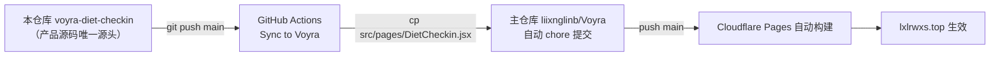

# 饮食打卡 · Diet Check-in

体重、三餐执行、饮水 / 步数 / 力量训练 / 破戒标记与血压的**每日打卡工具**，带 7 日均线趋势、连续全勤记录与近 14 天打卡热力图。内置个人快速减脂档方案速查（2000 kcal / 蛋白 ≥120g / 红线规则）。

**线上地址**：https://lxlrwxs.top/#/diet-checkin （需登录 Voyra 账号，数据按账号云端隔离，多端可用）

[](https://github.com/liixnglinb/voyra-diet-checkin/actions/workflows/sync-to-voyra.yml)
[](LICENSE)

## 特性 / Features

- ✅ **每日打卡**：晨起体重、血压（选填）、三餐三态执行（按方案 / 小偏差 / 破戒）、饮水 ≥2000ml、步数 ≥8000、力量训练、无破戒标记
- 📈 **趋势看板**：体重折线 + 7 日均线（纯 SVG，零图表依赖）、近 14 天打卡热力图、连续全勤天数、近 7 日完成率
- 🎯 **目标追踪**：阶段目标 94 → 87 → 80 kg，自动计算已减体重
- 📋 **方案速查**：内置快速档执行清单与安全红线（头晕心悸回撤、平台期规则）
- ☁️ **云端同步**：登录 Voyra 账号后数据按账号隔离存于 Bmob，手机 / 电脑多端可用
- 🧩 **零图表依赖**：趋势图为手写 SVG，不引入任何图表库

## 技术栈 / Tech

React 18 · Vite 5 · react-router-dom (HashRouter) · lucide-react · Bmob（经主仓库共享层 `api.js`）· 原生 SVG

## 同步架构 / Sync Architecture



## 开发 / Development

本仓库**不能独立运行**（缺主仓库共享层：Layout / AuthGate / api.js 等）。本地调试请使用主仓库：

```bash
cd "D:\Voyra 个人网站"
npm install
npm run dev      # 打开 http://localhost:5173/#/diet-checkin
npm run build    # 生产构建验证
```

修改流程：改本仓库 `src/pages/DietCheckin.jsx` → push main → Actions 自动同步回主仓库 → Pages 自动部署。

## 关键词 / Keywords

饮食打卡 · 减肥打卡 · 体重记录 · 体重管理 · 减脂打卡 · 习惯追踪 · 血压记录 · diet check-in · weight tracker · habit tracker · obesity management
